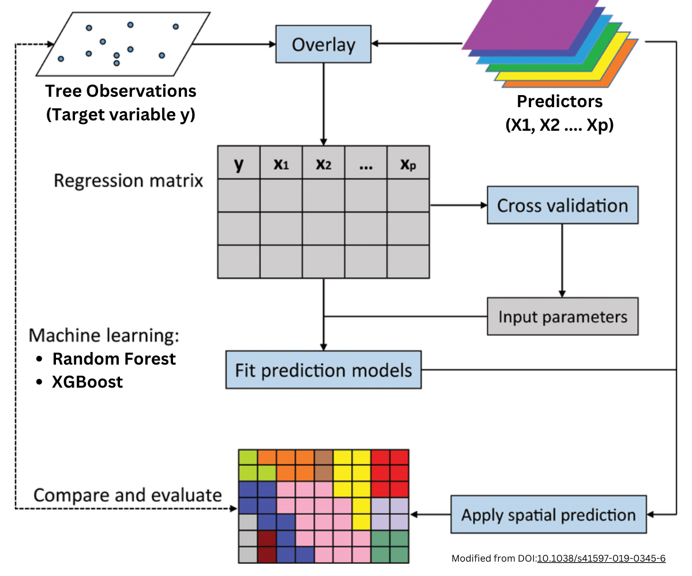

```{r setup, include=FALSE}
knitr::opts_chunk$set(echo = TRUE, message=F, warning=F)
```


# Introduction

In this practical exercise we will use some of the techniques we learned to create a spatial predictive model. The objective of this work will be mapping tree species across the landscape to create a predicted map of tree species at 10m resolution over a single Sentinel tile.
Data are available as part of the material shared with you by Prof. Saia so you should have it already alongside this code. In the various folders you can find a CSV with tree samples, sentinel images and several multispectral bands, a DEM and a portion of the Corine Landcover dataset.

The general idea of a statistical model is to extrapolate in space a series of data that were collected at discrete locations but cover larger areas. In essence, it is not possible to classify every single tree in a forest, so surveys are carried out to record trees in sample locations.

We know that trees do not only grows in samples areas, so we need a reliable method to map trees over the entire spatial extend of the forest. This is the main objective of a spatial modelling or mapping exercise.

In statistical terms the tree species, which is what we need to map, is called the target (or response) variable, while all the environmental raster data we will use to extrapolate tree species in space are the predictors (or covariates). In order to train a machine learning model to learn the correlation between response and predictors we first need to extract (overlay step) the predictors values for all the locations in which we have a tree classification. 

A schematic diagram of the whole process is mapped out below:



We are going to need several packages, and if you do not have them installed please run the following code manually.

```{r, eval=F}
install.packages(c("dplyr","raster","readr","terra","sf","stringr","caret","ranger","xgboost","randomForest"))
```

Next we need to load the packages:

```{r}
library(dplyr)
library(readr)
library(raster)
library(terra)
library(sf)
library(stringr)
library(caret)
library(ranger)
library(xgboost)
```


# Data Preparation

## Forestry Data

Tree species data were downloaded from the database provided in connection to the paper entitled [EU-Forest, a high-resolution tree occurrence dataset for Europe](https://www.nature.com/articles/sdata2016123#Sec3).
Data are provided in CSV with coordinates, which we can then turn into a spatial object:

```{r}
TreeSpp <- read_csv("ForestryData/EUForestspecies.csv")
glimpse(TreeSpp)
```
Let's now extract only trees in Italy and transform them into a spatial object, using the method we've used in the previous lesson. The coordinate system is indicated in the paper as [ETRS89-LAEA](https://epsg.io/3035), so the EPSG code is 3035:

```{r}
ItalySpp <- TreeSpp %>% 
  filter(COUNTRY == "Italy") %>% 
  st_as_sf(coords = c("X", "Y"),
           crs=st_crs(3035))
```

Now that we only have a small subset of the dataset, we need to further reduce its size by spatially filtering it to the modelling area I've selected.
The polygon I used is the tile 33TUH from the Sentinel grid, which is stored in the folder `ModellingArea`:

```{r}
ModellingArea <- st_read("ModellingArea/Tile_33TUH.geojson") %>% 
  st_transform(st_crs(3035))

ModellingSpp <- st_intersection(ItalySpp, ModellingArea)
```

We can look at all the species of trees in the modelling area:

```{r}
unique(ModellingSpp$SPECIES.NAME)
```

Since we are working with satellite data with a resolution of 10m I think it is going to be challenging to distinguish between all of these species, particularly the subspecies that might look similar in terms of spectral response.

One way to simplify these data is to extract the main species only, i.e. the first word of the `SPECIES.NAME`. We can do that using a function from the package `stringr`, which deals specifically with string manipulation:

```{r}
str_split_i(unique(ModellingSpp$SPECIES.NAME), " ", 1)
```

### String Manipulation References

Since string manipulation is a large part of what it means to be working as a data scientist and I only touched upon it, I've added below a couple of references to learn more about this important topic:

- [https://stringr.tidyverse.org/](https://stringr.tidyverse.org/)
- [https://rpubs.com/iPhuoc/stringr_manipulation](https://rpubs.com/iPhuoc/stringr_manipulation)


Let's see now how many of these species are available in the locations inside the modelling area:

```{r}
ModellingSpp %>% 
  as_tibble() %>% 
  mutate(Spp = str_split_i(SPECIES.NAME, " ", 1)) %>% 
  group_by(Spp) %>% 
  summarise(Count = n()) %>% 
  arrange(desc(Count))
```

For this exercise, let's classify only species with at least 60 samples and exclude all others. It is not going to give us an optimal results at the end, but the purpose of this exercise is just to show you how to model spatial data.

```{r}
SppLookup <- ModellingSpp %>% 
  as_tibble() %>% 
  mutate(Spp = str_split_i(SPECIES.NAME, " ", 1)) %>% 
  group_by(Spp) %>% 
  summarise(Count = n()) %>% 
  filter(Count > 60)

SppLookup
```

The code above simply filters `Count` and returns a table we can use to filter the main dataset:

```{r}
ModellingData <- ModellingSpp %>% 
  mutate(Spp = str_split_i(SPECIES.NAME, " ", 1)) %>% 
  filter(Spp %in% SppLookup$Spp) %>% 
  mutate(ID = 1:n()) %>% 
  dplyr::select(ID, Spp)

ModellingData
```

I created a column with a numerical ID in case we need to keep track of each row.

## Corine Forest Mask

In the data provided there is an extract from the [Corine Land Cover map 2018](https://land.copernicus.eu/en/products/corine-land-cover/clc2018), which we can use to create a forest mask. In technical terms, a forest mask is a binary raster (0, 1), where 1 is forested area and 0 is any other land use.

The reason why we need this is that, since the model will only be trained with tree species it will basically predict trees everywhere, so part of the final map will not make sense. To produce something sensible we need to remove all predictions from land use types where there are no trees. A binary raster will allow us to simply multiply our results and the forest mask and basically turn to NULL all pixels that are not either forest or woodland.

Let's import the raster:

```{r}
CorineClip <- rast("Corine/CorineClip.tif")
plot(CorineClip)
```

As we can see from the numerical legend on the right, this raster is numerical. Since we know it is showing land use types, we might guess that each number represents a different land use.

When distributing the file, the data provider included a lookup table:

```{r}
corine_lookup <- sf::st_read("Corine/U2018_CLC2018_V2020_20u1.tif.vat.dbf")
head(corine_lookup)
```

We can use the `LABEL3` to extract only land use type that include forest or woodland:

```{r}
forest_landuse <- corine_lookup %>% 
  filter(LABEL3 %in% c("Broad-leaved forest", "Coniferous forest", "Mixed forest", "Transitional woodland-shrub"))
forest_landuse
```

The column `VALUE` shows the numbers of the pixels in the raster. So now it is just a matter of turning the previous raster into binary:

```{r}
corine_mask <- ifel(CorineClip %in% c(23,24,25,29), 1, 0)
plot(corine_mask)
```

The `ifel` function from the package `terra` is similar to the function `con` in ArcGIS and allows us to modify a raster based on an if-else statement.


## Sentinel Images

In the Sentinel folder I've prepared a series of sentinel 2 images from 3 dates:

- Summer image: 19-07-2023
- Autumn image: 02-10-2023
- spring image: 14-04-2024

These images can be loaded in R like we've done above for the Corine land cover. Let's look at the TCI (True Color Image for Summer 2023):

```{r}
TCI_summer <- rast("Sentinel/TCI_S2A_T33TUH_20230719T100030_L2A.tif")
plot(TCI_summer)
```

One way to quickly load numerous file is using the function `list.files`, which searches through a path to find files with a particular pattern: in this case we need files with spectral bands 2, 3, 4 and 8. To learn more about Sentinel Spectral bands head to [gisgeography.com](https://gisgeography.com/sentinel-2-bands-combinations/).

```{r}
sent_files <- list.files(path="Sentinel/",
                         pattern="B02|B03|B04|B08",
                         full.names = T)
sent_files
```

Since this is a list, we can call the function `lapply` to load all these files:

```{r}
sent_raster <- lapply(sent_files, rast)
glimpse(sent_raster)
```

The object `sent_raster` is now a list of rasters. We will use it later on when we need to create the predictors for our analysis.

## Vegetation Indices

Now we can start preparing the vegetation indices, which are calculated from individual spectral bands to enhance particular features in the signal (please use the references for more info).

The most popular vegetation index is the NDVI (Normalized Difference Vegetation Index), which is calculated using bands B08 and B04. It is probably not the best for this type of analysis, but the way we calculate NDVI here would be very similar to the way you can calculate many other indices.

```{r}
Summer_B04 <- rast("Sentinel/B04_S2A_T33TUH_20230719T100030_L2A.tif")
Summer_B08 <- rast("Sentinel/B08_S2A_T33TUH_20230719T100030_L2A.tif")
```

Raster calculation is R is extremely simple:

```{r}
#NDVI = (B08 - B04) / (B08 + B04)

Summer_NDVI <- (Summer_B08 - Summer_B04) / (Summer_B08 + Summer_B04)
names(Summer_NDVI) <- "Summer_NDVI"
plot(Summer_NDVI)
```

Now we can simply repeat the process for the other two dates:

```{r}
Spring_B04 <- rast("Sentinel/B04_S2A_T33TUH_20240414T100603_L2A.tif")
Spring_B08 <- rast("Sentinel/B08_S2A_T33TUH_20240414T100603_L2A.tif")

Spring_NDVI <- (Spring_B08 - Spring_B04) / (Spring_B08 + Spring_B04)
names(Spring_NDVI) <- "Spring_NDVI"


Autumn_B04 <- rast("Sentinel/B04_S2B_T33TUH_20231002T100024_L2A.tif")
Autumn_B08 <- rast("Sentinel/B08_S2B_T33TUH_20231002T100024_L2A.tif")

Autumn_NDVI <- (Autumn_B08 - Autumn_B04) / (Autumn_B08 + Autumn_B04)
names(Autumn_NDVI) <- "Autumn_NDVI"
```

If required, we can save the NDVI objects with the function `writeRaster`


### References

There are many other more appropriate vegetation indices to use for such a modelling exercise, and below you can find material about them:

- [Sentinel-2 data and vegetation indices](http://www.eo4geo.eu/training/sentinel-2-data-and-vegetation-indices/)
- [Sentinel-2 RS indices](https://custom-scripts.sentinel-hub.com/custom-scripts/sentinel-2/indexdb/)


## DEM Derivatives

In the folder DEM is available part of the [Tinitaly DEM](https://tinitaly.pi.ingv.it/) from INGV. The file has been cropped, but it needs to be projected to UTM zone 33N, which is the projection of the Sentinel images.

Let's first load the DEM and have a look at it:

```{r}
DEM <- rast("DEM/DEM.tif")
plot(DEM)
```

Projecting a raster is very simple with the function`project` in the package `terra`:

```{r}
DEM_33N <- project(DEM, Autumn_NDVI)
```


In this section we are going to calculate a few DEM derivatives, namely slope and the topographic position index (TPI). For these two simple ones there is a dedicated function named `terrain`. Let's first load the DEM:


Now we can simply use the function `terrain` to generate the derivatives:

```{r}
Slope <- terrain(DEM_33N, v=c("slope"))
TPI <- terrain(DEM_33N, v=c("TPI"))
```


### References

To learn more about DEM derivatives please use the references below:

- [DEM Analysis – The many uses and derivatives of a Digital Elevation Model](https://rgis.unm.edu/dem_analysis/)
- [An illustrated introduction to general geomorphometry](http://iflorinsky.impb.ru/Florinsky-2017i.pdf)

# Modelling

Now that we have prepared the data we can proceed with the modelling. 

## Training Data

The function to extract raster values for discrete location is called `extract`:

```{r}
extract(Slope, ModellingData, ID=FALSE) %>% head()
```

We need to perform this operation for each raster and then collect the results into a table. We can either do it one step at the time, or create a slightly more advanced piece of code to do it all at once:

```{r}
rast_list <- list(Slope, TPI, DEM_33N, sent_raster, Summer_NDVI, Spring_NDVI, Autumn_NDVI)

extr_list <- rapply(rast_list, function(x){extract(x, ModellingData, ID=FALSE)}, how="list")
```

Here we are first creating a list of rasters, then we can use the `rapply` function to recursively extract data from each raster in the list. Then we can append all the results into a single table, which needs to start with the tree species:

```{r}
TrainingData <- cbind(ModellingData, bind_cols(extr_list))
TrainingData
```

This table is what in the schematic representation of the process is referred to as the regression matrix, which is what we need to train the machine learning algorithm.

## Cross-Validation

The aim of this analysis is modelling tree species across the landscape with a statistical model. There are many different models to choose from, therefore the model selection step is crucial in any analysis. One way to choose the best model for our analysis is through cross-validation, which is a technique whereby we use our training data to test and compare different algorithms.

Cross-validation is a method that splits our data into non-overlapping subsets, called folds. Each fold is then excluded from the training and used to test the performance of the algorithm. The process continues until each fold has been used once for validation. A schematic representation of the cross-validation is presented below.


This is the process we are going to use in this exercise for selecting the best algorithm. We start the process by splitting our data into the dependent variable (in our case tree species), and the predictors:

```{r}
input_y <- as.factor(as.data.frame(TrainingData)[,"Spp"])

input_x <- as.data.frame(TrainingData)[,3:20]
```

Now we can use the package `caret` to test a couple of popular models. A full list of all the model we can test in `caret` using the same code is available here: [List of ML Models](https://topepo.github.io/caret/train-models-by-tag.html)

First of all, we need to specify a few parameters to tell `caret` how to perform the cross-validation we need. We can do that with the function `trainControl`:

```{r}
tune_control <- trainControl(
    method = "cv", 
    number=5,
    search="random",
    classProbs = TRUE,
    verboseIter = FALSE, 
    allowParallel = TRUE 
  )
```

The option `method="cv"` tells `caret` that we intend to perform a standard cross-validation like the one shown above, with 5 folds (option `number=5`). Finally, the option `search="random"` is used to allow `caret` to choose the best parameters for the machine learning model.

Now that we've set the control we can start the training process. We'll first test a [random forest](https://www.ibm.com/topics/random-forest#:~:text=Random%20forest%20is%20a%20commonly,Decision%20trees) model:

```{r}
tune <- caret::train(
          x = input_x,
          y = input_y,
          trControl = tune_control,
          tuneLength = 5,
          method = "rf",
          verbose=FALSE
        )
```

We can look at the `tune` object to learn mode about our model:

```{r}
tune
```

The reason why `caret` is so popular is that to test another model from the huge selection available, we only need to change one line of code. Below we are testing an [XGboost](https://www.nvidia.com/en-us/glossary/xgboost/) model, and the only thing we need to change is the option `method`: 


```{r}
tune_xgb <- caret::train(
          x = input_x,
          y = input_y,
          trControl = tune_control,
          tuneLength = 5,
          method = "xgbTree",
          verbose=FALSE
        )
```


```{r}
tune_xgb
```

This is a more complex model and its accuracy is better than random forest, so between the two we can choose this one to create the final predicted map of tree species.


## Final Training and Prediction

Now that we know which model is the best for our dataset, we can perform the final training, using the set of parameters identified before (option `tuneGrid  = tune_xgb$bestTune`). As you can see from the code below, now the option `method="none"` tells `caret` that we do not intend to perform a cross-validation but simply train the model using the full training set:


```{r}
tune_control_final <- caret::trainControl(
  method = "none", 
  verboseIter = FALSE, 
  allowParallel = TRUE 
)

tune_final <- caret::train(
  x = input_x,
  y = input_y,
  trControl = tune_control_final,
  tuneGrid  = tune_xgb$bestTune,
  method = "xgbTree",
  verbose=FALSE
)
```

Now that we have the model we can use it to predict our area of interest, which is the area covered by the Sentinel tile with a spatial resolution of 10m. To do so we first need to create a stack of raster with all of our predictors:

```{r}
raster_list <- rapply(rast_list, raster)
prediction_stack <- stack(raster_list)
```

The function `predict` can now be used to create the final tree species prediction. Since we are working over a large area, the code below will take several minutes (if not hours depending on your machine), so please do not run it in class:

```{r, eval=F}
TreeSppPred <- predict(object=prediction_stack, 
                       model=tune_final,
                       progress="text", 
                       na.rm=TRUE, 
                       inf.rm=TRUE)
```

I already created the resulting raster and saved it in the folder `Results`, so that we do not have to wait for the function about to finish:

```{r}
TreeSppPred <- rast("Results/TreeSppPred.tif")
plot(TreeSppPred)
```

Apparently the algorithm was unable to predict all tree species, which were 7 in total, but only a few. This clearly suggest that our approach is not optimal. We may need to find more or better tree data, or perhaps the predictors we have are not correlated enough with tree species to be useful for mapping them. Since the purpose of this exercise is just learn how to do spatial modelling, I am not too bothered about this result. However, it is important to highlight the fact that whatever you feed to a machine learning algorithm, it will create a result and it is your responsibility to make sure that result is reliable. Do not trust algorithms too much, these can only work if the data you feed them are sound, otherwise they will fail miserably. 

## Forest Masking

As I mentioned above, the model predicts everywhere even in areas where there is no forest or woodland, which is the reason why we created the forest mask. However, the forest mask was created using Corine, which has a different projection compared to Sentinel and a different resolution (100m instead of 10m). So before we can use it to mask our results we need to reproject it and change its resolution. Both of these actions can be performed using once again the function `project`.

Since this is another operation that takes some time, its results are already available as a .tif file in the folder `Results`.

```{r, eval=F}
corine_reproj <- project(x=corine_mask, y=TreeSppPred, res=10)
```

```{r}
corine_reproj <- rast("Results/corine_reproj.tif")
```


Now we can simply multiple the modelling results for the forest mask to obtain a layer where predictions are confined to forested areas:

```{r}
TreeSppPredMasked <- TreeSppPred * corine_reproj
plot(TreeSppPredMasked)
```


## Save Results in Tif

Now we just need to save our results with the function `writeRaster` and our work is done!

```{r}
writeRaster(TreeSppPredMasked, filename = "TreeSppPredMasked.tif", overwrite=TRUE)
```

